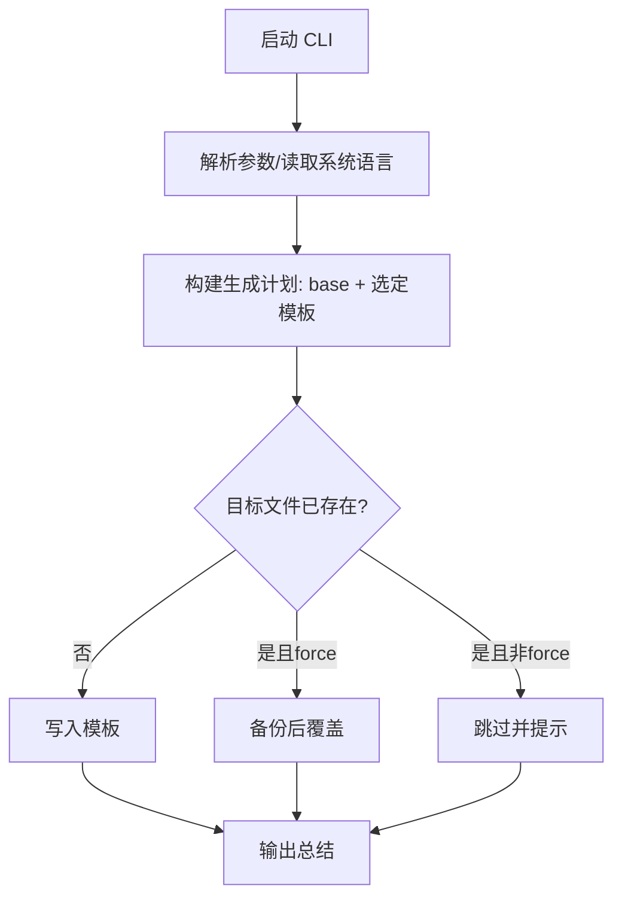

// Reason: Decoupled from runtime code to document blueprint before implementation.

# IDE 规则初始化 npm 包设计

## 背景
- 需要一个 npm 包，帮助用户在本地或通过 npm registry 安装后，快速初始化 `.cursor/rules` 目录，复用现有 `base.mdc`，并按用户选择的前后端框架或语言生成对应的补充规则。
- 默认语言为中文，若能识别到系统语言则优先使用，可通过参数覆盖。
- 用户希望通过交互式选择（而非命令行参数列出框架）完成前后端/语言/IDE 选择。
- 自定义 IDE 需要允许用户输入名称（如 `aicode`），规则应写入 `.<ide>/rules/*.mdc`（例：`.aicode/rules/*.mdc`）。
- 框架与语言需支持自定义名称输入，以保持可扩展性；语言列表默认含全球量排名 Top 10，固定将 JavaScript、TypeScript 置顶，其余按语言名称排序。

## 目标
- 提供 CLI：`npx <pkg>` 或本地执行，生成/更新 `.cursor/rules`。
- 固化基线规则：直接沿用现有 `.cursor/rules/base.mdc` 原样输出。
- 框架/语言扩展：按用户选择生成对应 `.mdc`，前端/后端/语言可扩展。
- 多语言：支持 zh-CN、en-US（可扩展），按系统语言检测，无法识别时默认中文，支持 `--lang` 覆盖。
- 安全写入：避免覆盖用户已有自定义内容，可选择跳过或备份。

## EARS 需求
- 当用户在项目根目录执行 `npx ide-rule` 时，CLI 以交互式问答（多选/单选）收集 IDE（含自定义输入）、前端框架、后端框架、语言，并创建目标规则目录，写入 `base.mdc` 与对应模板。
- 当用户输入自定义 IDE 名称（如 `aicode`）时，规则写入 `.<ide>/rules/*.mdc`（例：`.aicode/rules/base.mdc`），其余逻辑与内置 IDE 相同。
- 当检测到系统语言（如 `en-US`）且用户未显式指定语言时，工具按检测结果生成对应语言模板，否则使用中文；可通过 `--lang` 覆盖。
- 当用户已有同名 `.mdc` 且未传入 `--force` 时，工具应跳过写入并提示已存在；传入 `--force` 时应覆盖并备份旧文件。
- 当用户选择框架后生成模板计划，若选择为空（全部跳过），则仅写入 `base.mdc` 并提示可再次运行补全。
- 当用户初始化时，同时生成 `docs/project_memory.md`，内容来自内置 `templates/project_memory_example.md`，并遵循同样的覆盖/备份策略。

## 范围 / 非范围
- 范围：CLI 交互、系统语言检测、规则模板渲染与写入、最小化依赖（兼容 Node 14）、npm 发布与本地使用。
- 非范围：复杂 GUI、在线拉取远端模板、自动检测项目框架（后续可扩展）。

## 流程 (Mermaid)

## 数据结构定义
- `GenerationOptions`: `{ targetDir: string; ide: 'cursor' | 'trae' | 'vscode' | string; frontend?: string[]; backend?: string[]; language?: string[]; locale?: 'zh-CN' | 'en-US' | string; force?: boolean; }`
- `RuleTemplate`: `{ id: string; name: string; target: string; locale?: string; content: string; }`
- `LocaleBundle`: `{ locale: string; messages: Record<string, string>; }`
- `ScaffoldPlan`: `{ locale: string; baseTemplate: RuleTemplate; extraTemplates: RuleTemplate[]; backups: string[]; }`

## CLI 形态与默认值
- 命令：`npx ide-rule` 或 `node ./bin/cli.js`
- 交互式选项：
- IDE：`cursor | trae | vscode | custom(用户输入)`，自定义时写入 `.<ide>/rules/`
  - 前端：`react | next | vue | nuxt | angular | svelte | custom(用户输入) | none`（多选）
  - 后端：`node-express | nest | koa | fastify | custom(用户输入) | none`（多选）
  - 语言（多选，含自定义输入）：`javascript | typescript | c | c# | c++ | go | java | php | python | ruby | custom`
    - 展示顺序固定：`javascript`, `typescript` 置顶，其余按名称字母序
  - 语言环境：自动检测；提示是否使用检测结果；可选 `--lang zh-CN|en-US` 覆盖
  - 覆盖策略：询问是否覆盖已有文件；`--force` 直通覆盖并备份
- 输出目录：内置 IDE 使用 `.cursor/rules/`，自定义 IDE 使用 `.<ide>/rules/`

## 多语言策略
- 依赖 `os-locale` 检测系统语言（Node 14 兼容）。
- 语言包：`locales/zh-CN.json`、`locales/en-US.json`，未命中时回落 `zh-CN`。
- 模板文本按语言分层，支持未来扩展。

## 风险与对策
- Node 14 依赖兼容：选用无 ES2020+ 语法或编译为 CJS。
- 覆盖风险：默认跳过已有文件，`--force` 时生成 `.bak` 备份。
- 模板扩展：通过配置表注册新框架，避免硬编码散落。

## 里程碑 / 验收
- 验收 1：执行默认命令生成 `.cursor/rules/base.mdc` 与提示，无错误退出码。
- 验收 2：指定 `--frontend react --backend nest --lang en` 生成对应多语言模板。
- 验收 3：已有文件且未传 `--force` 时跳过并提示；传入后备份并覆盖。

